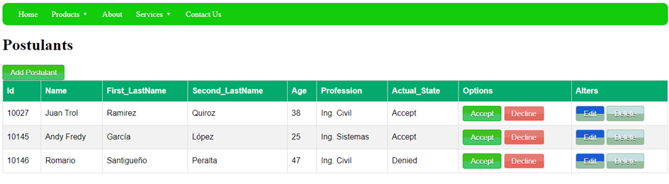
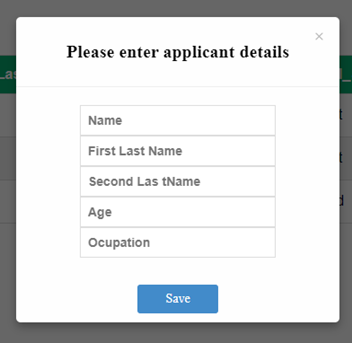
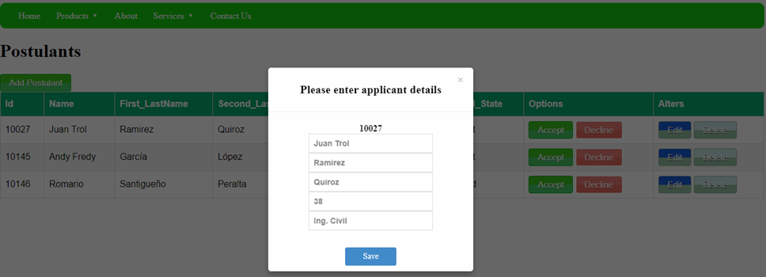

# CRUD Flask Python

Using:
* Python
* Flask
* SQL Server
* HTML, CSS, JavaScript


## Configuration

### Init

* Create Env ss:
  ``` bash
  python -m venv env
  ``` 

* Activate Env:
  ``` bash
  env\Scripts\activate
  ```

* Options in Env

  * Desactivate:
    ``` bash
    deactivate
    ```

  * List Librarys:
    ``` bash
    pip list
    ```

  * Update pip:
    ``` bash
    py -m pip install --upgrade pip
    ```

### BackEnd

* Activate Env:
  ``` bash
  pip install -r requirements.txt
  ```
  
* Content requirements.txt

  * Flask==2.2.2
  * Werkzeug==2.2.2
  * pyodbc==4.0.34

* Connection_sql.txt convert txt -> .py 
  
  ``` bash
  s = '****' #Your server name 
  d = '****' #DATABASE
  u = '****' #Your login
  p = '****' #Your login password
  ```

****
## Views

#### index

****
#### Add Postulant


****
#### Update

